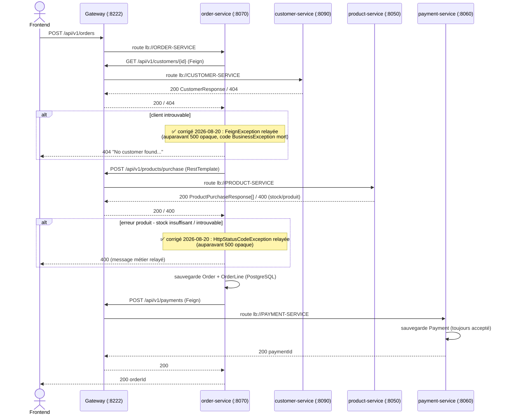
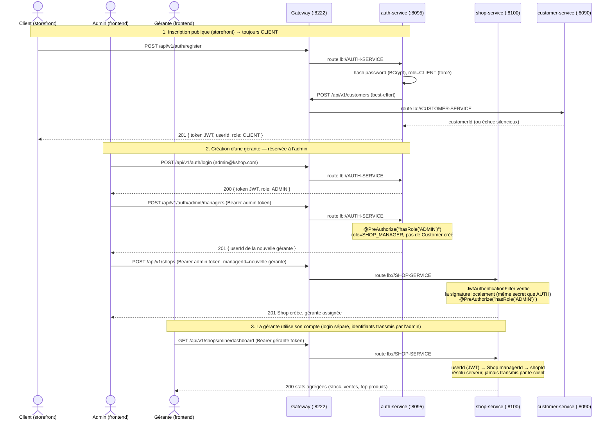
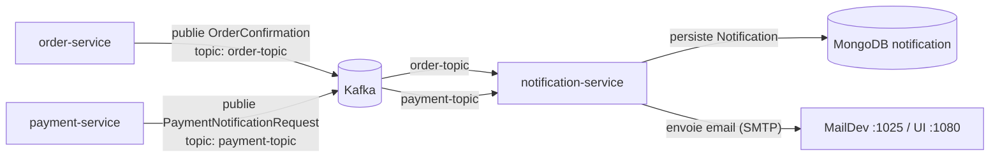
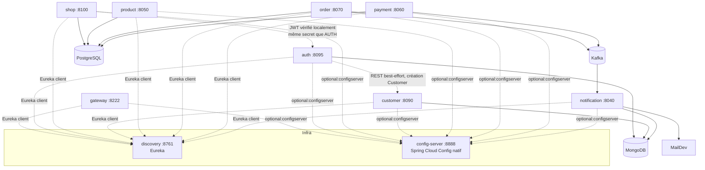

# Documentation API — ms-stock-management

Documentation produite par lecture directe du code source (contrôleurs, DTOs, handlers d'exception), **pas** par extraction d'une spécification OpenAPI/Swagger : aucune dépendance `springdoc-openapi` n'existe dans le repo (vérifié initialement sur les 8 modules d'origine, toujours vrai sur `auth`/`shop` ajoutés le 2026-09-17 — 10 modules au total). Voir [gateway.md](api/gateway.md#agrégation-swagger) pour le détail.

Toutes les données ci-dessous ont été vérifiées contre le code du package `com.franck.*` (post-renommage Phase 1), sur la branche `refactor/rename-to-franck`.

## Sommaire

| Service | Rôle | Endpoints REST | Base path (via gateway) |
|---|---|---|---|
| [gateway](api/gateway.md) | Point d'entrée unique, routage | — (routeur) | `http://localhost:8222` |
| [auth](api/auth.md) | Authentification, émission JWT, rôles `CLIENT`/`SHOP_MANAGER`/`ADMIN` | 4 | `/api/v1/auth` |
| [shop](api/shop.md) | Gestion boutique + stock + ventes (gérante), création boutique (admin) | 15 | `/api/v1/shops` |
| [customer](api/customer.md) | Référentiel clients (CRUD) | 6 | `/api/v1/customers` |
| [product](api/product.md) | Catalogue produits + décrément de stock | 4 | `/api/v1/products` |
| [order](api/order.md) | Orchestration des commandes | 4 (2 contrôleurs) | `/api/v1/orders`, `/api/v1/order-lines` |
| [payment](api/payment.md) | Enregistrement des paiements (simulé) | 1 | `/api/v1/payments` |
| [notification](api/notification.md) | Consommateur Kafka + email (pas de REST) | 0 | — |

Services d'infrastructure non documentés ici (pas d'API métier) : `discovery` (Eureka, `:8761`), `config-server` (Spring Cloud Config natif, `:8888`).

**Authentification** : **JWT (HS384) sur `auth-service` et `shop-service`** uniquement, introduit après la rédaction initiale de cette documentation (voir [auth.md](api/auth.md) et [shop.md](api/shop.md) pour le détail complet — rôles, endpoints, modèle de données, exemples de requêtes). **`customer`, `product`, `order`, `payment` restent sans aucune authentification** (hypothèse initiale de la Phase 0, toujours vraie pour ces 4 services).

---

## Flux d'appels inter-services

### Synchrone — création d'une commande (`POST /api/v1/orders`)

Tous les appels sortants d'`order-service` passent par la **gateway** (`localhost:8222`), pas directement vers les services cibles (URLs configurées ainsi dans `config-server`).

### Authentification et gestion de boutique (JWT)

- `shop-service` **ne dépend pas** d'un appel réseau à `auth-service` pour valider un token : la clé secrète JWT est dupliquée dans `shop-service.yml` (config-server), permettant une vérification locale et stateless.
- Tout le stock/ventes/dashboard de `shop-service` est un **domaine séparé** de `product-service` (pas de FK, pas d'appel croisé) — voir [shop.md](api/shop.md#décision-de-conception--stock-indépendant-du-catalogue-product-service) pour la justification complète.

### Asynchrone — confirmations via Kafka

- `order-service` publie sur `order-topic` **après** que `payment-service` a répondu avec succès (dernière étape du flux synchrone).
- `payment-service` publie sur `payment-topic` **juste après** avoir persisté le paiement — indépendamment du flux `order-service` (peut aussi être déclenché par un appel direct à `POST /api/v1/payments`, hors flux commande).
- Les deux flux Kafka sont **fire-and-forget** : aucun accusé de réception n'est renvoyé au flux synchrone, et un échec d'envoi d'email n'a aucun impact sur la réponse HTTP de `POST /api/v1/orders` ou `POST /api/v1/payments`. ✅ Un échec d'envoi d'email déclenchait auparavant une tempête de retries Kafka + des doublons MongoDB + une perte silencieuse de la notification — **corrigé le 2026-08-20**, voir [notification.md](api/notification.md#-bug-critique-corrigé-le-2026-08-20--tempête-de-retries-kafka--doublons-mongodb-sur-échec-demail).

### Vue d'ensemble statique

---

## Points transverses — résultats Phase 3 (tout finalisé le 2026-08-20)

> Cette section a été mise à jour après exécution réelle des tests, puis après correction et revalidation des 6 bugs identifiés + des 3 points restés ouverts (voir [TEST_REPORT.md](TEST_REPORT.md) pour le détail complet).

1. ~~**Aucune authentification**~~ — ✅ **partiellement introduit (2026-09-17)** : `auth-service` (émission JWT, BCrypt, rôles `ADMIN`/`SHOP_MANAGER`) et `shop-service` (vérification JWT + `@PreAuthorize` par rôle) sont désormais protégés. **`customer`, `product`, `order`, `payment` restent sans authentification** — voir [auth.md](api/auth.md), [shop.md](api/shop.md), et [gateway.md](api/gateway.md#points-dattention) pour le détail exact du périmètre couvert/non couvert.
2. **"Paiement refusé" n'existe pas** — confirmé : `payment-service` accepte toujours le paiement en tant que tel (la validation ajoutée rejette désormais les données structurellement invalides — montant négatif, email mal formé — mais il n'y a toujours aucune logique de refus métier), voir [payment.md](api/payment.md).
3. ~~**Incohérence des codes d'erreur "ressource introuvable"**~~ — ✅ corrigé : `product-service` renvoie désormais `404` comme `customer`/`order`.
4. ~~**`POST /api/v1/orders` renvoie `500` opaque pour les 3 cas métier gérés en aval**~~ — ✅ corrigé : `404` (client introuvable) et `400` (produit introuvable/stock insuffisant) avec messages métier relayés.
5. ~~**🔴 Bug critique** : tempête de retries Kafka + doublons MongoDB sur échec d'email~~ — ✅ corrigé (`@EnableAsync` + catch élargi), voir [notification.md](api/notification.md).
6. ~~**🔴 Bug** : montant (`amount`) d'une commande jamais persisté~~ — ✅ corrigé (`OrderMapper.toOrder()` complété).
7. ~~**CORS non configuré côté gateway**~~ — ✅ corrigé et revalidé par une requête `OPTIONS` preflight réelle, voir [gateway.md](api/gateway.md#cors).
8. ~~**Pas de transaction distribuée/saga** : stock jamais restauré si le paiement échouait après décrément~~ — ✅ compensation de stock (saga légère) ajoutée et revalidée (`payment-service` coupé artificiellement, stock confirmé restauré), voir [order.md](api/order.md#-compensation-de-stock-saga-légère--ajoutée-le-2026-08-20). Reste une solution best-effort, pas une saga complète.
9. ~~**Nom Feign trompeur** `@FeignClient(name="product-service")` sur `PaymentClient`~~ — ✅ corrigé.
10. ~~**`order-service`/`payment-service` en `ddl-auto: create`**~~ — ✅ **corrigé (2026-09-17)** : migré vers Flyway + `ddl-auto: validate` (alignés sur `product-service`), schéma initial `V1__init_database.sql` sur chaque service. Élimine le risque de perte de données au redémarrage.
11. **Environnement de build** — la machine de développement n'avait que JDK 25 et JDK 8 installées ; Lombok (même en 1.18.48, la dernière version disponible au 2026-09-17) ne supporte pas encore l'annotation processing sous JDK 25. **JDK 17 (Eclipse Temurin) installée manuellement** (`C:\Users\<user>\java\jdk-17`, `JAVA_HOME` persisté via `setx`) — prérequis à documenter pour toute nouvelle machine de dev sur ce repo.
12. **Collection Postman non mise à jour** (`docs/postman/ms-stock-management.postman_collection.json`) — les 18 endpoints de `auth-service` et `shop-service` n'y figurent pas encore ; seuls `customer`/`product`/`order`/`payment` sont couverts. À compléter avant de s'appuyer dessus pour des tests manuels d'intégration frontend.
